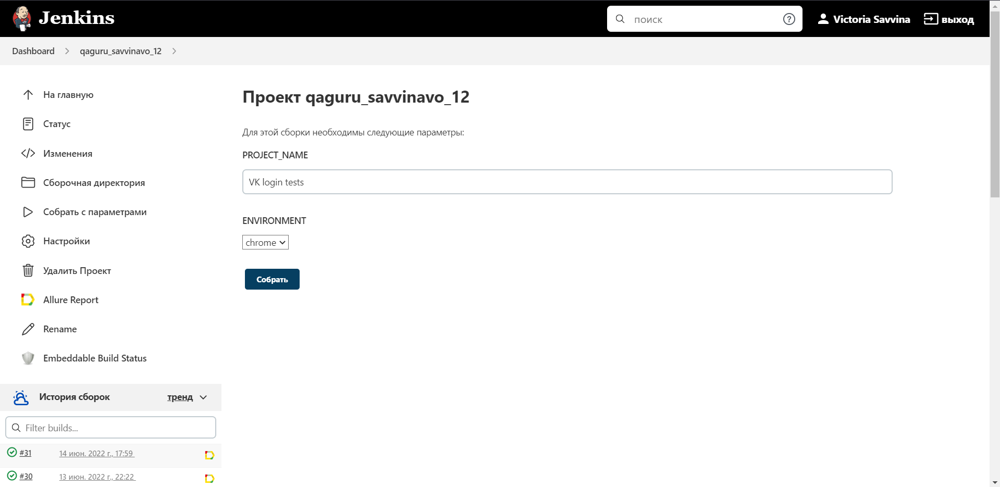
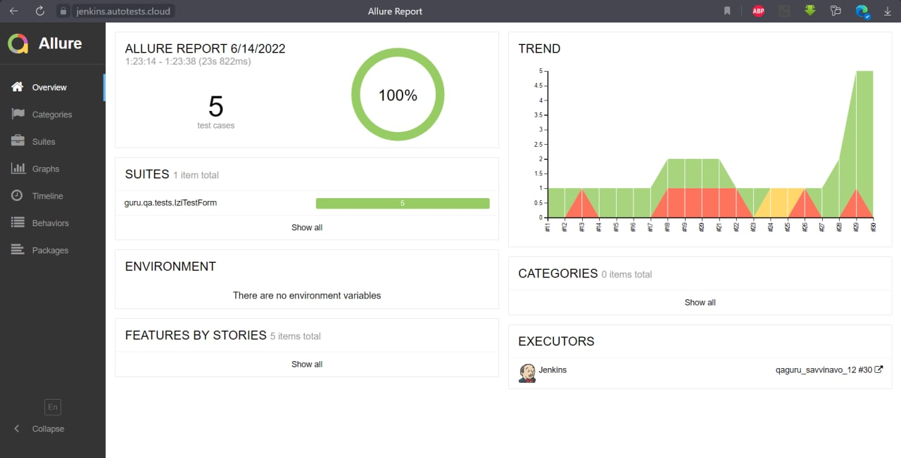
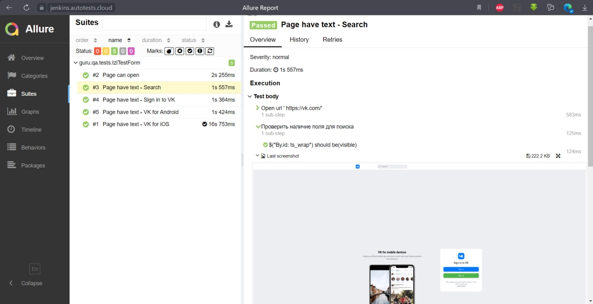
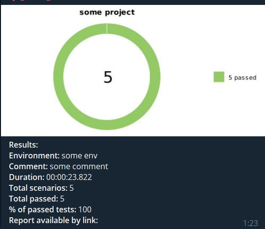

## Автотесты, написанные с целью проверки основных элементов на странице регистрации VK.
### Используемый стек технологий:
<p align="center">


</p>

### Автотестами покрыт следующий функционал:
* окрытие сайта
* проверка заголовка формы регистрации
* проверка версии VK для Andriod
* проверка версии VK для iOS
* проверка строки поиска на странице регистрации VK

### Параметры для запуска тестов в Jenkins:
```
gradle clean test
-DprojectName=${PROJECT_NAME}
-Denv=${ENVIRONMENT}
-DreportLink=${BUILD_URL}
-Dbuild.report.link=${BUILD_URL}
-DconfigFile=src/test/java/resource/notifications/telegram.json
-jar allure-notifications-4.1.jar
```

### Allure отчет:
 ```
allure serve build/allure-results
 ```

### Сборка автотестов параметризована:


### Отчёт о прохождении автотестов в Allure Report:


### Итоги прохожденяи тестов наглядно можно изучить с помощью сформированных скриншотов, видео, log-файлов: 


### Уведомление об успешном прохождении тестов отпарвляется с помощтью Чат-бота в Telegram. Флагом для формирования сообщения служит запись в логе BUILD SUCCESSFUL: 
